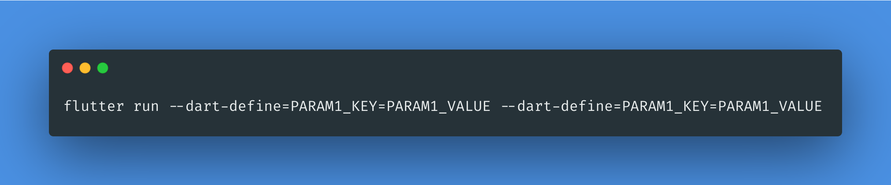

# Flutter Project Template by KeySun.dev




```
/// Pass Primary Bundleid
--dart-define=APP_BUNDLE_ID=dev.keysun.v1

/// Which Flavor You Want [Flavor will help us to use the different baseURL + Key + etc.]
--dart-define=env=dev

/// Pass App Name
--dart-define=APP_NAME=KeySunV1

/// If you want to add suffix
--dart-define=APP_SUFFIX=.dev

/// Run App by passing variables
flutter run --dart-define=APP_BUNDLE_ID=dev.keysun.v1 --dart-define=env=dev --dart-define=APP_NAME=KeySunV1 dart-define=APP_SUFFIX=.dev
```


Flutter & Dart
```
Flutter 1.22.3 • channel stable • https://github.com/flutter/flutter.git
Framework • revision 8874f21e79 (2 weeks ago) • 2020-10-29 14:14:35 -0700
Engine • revision a1440ca392
Tools • Dart 2.10.3

```


[Ref. Link for flavoring flutter application](https://itnext.io/flutter-1-17-no-more-flavors-no-more-ios-schemas-command-argument-that-solves-everything-8b145ed4285d)