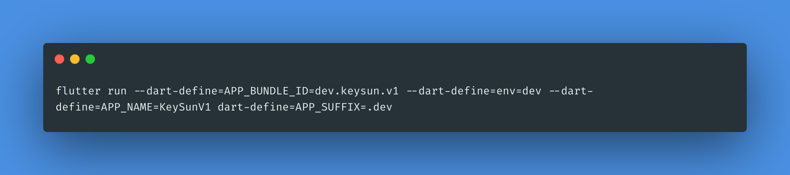

# flutter_keysun_template

### How to build/run app flavor wise
 
[Ref. Link for flavoring flutter application](https://itnext.io/flutter-1-17-no-more-flavors-no-more-ios-schemas-command-argument-that-solves-everything-8b145ed4285d)

## Run or Build dev env

flutter run --dart-define=env=dev --dart-define=APP_NAME=KeySunDev --dart-define=APP_SUFFIX=.dev

## Run or Build pro env

flutter run --dart-define=env=prod --dart-define=APP_NAME=KeySunPro --dart-define=APP_SUFFIX=